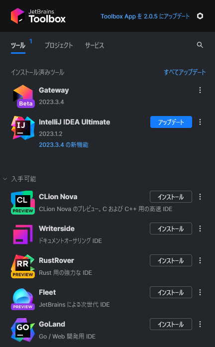

# 目次

- [1. 概要](#1-概要)
- [2. 開発環境の構築手順](#2-開発環境の構築手順)
  - [ローカルのマシンにインストール](#ローカルのマシンにインストール)
  - [リモートのマシンにインストール](#リモートのマシンにインストール)
- [3. ローカル環境での実行手順](#3-ローカル環境での実行手順)
  - [ブローカの実行](#ブローカの実行)
  - [クライアントの実行](#クライアントの実行)
- [4. クラウド環境での実行手順](#4-クラウド環境での実行手順)
  - [環境構築](#環境構築)
    - [AWS CLI の設定](#aws-cli-の設定)
    - [ECR の初期設定](#ecr-の初期設定)
      - [Docker のインストール](#docker-のインストール)
      - [提案手法のソフトウェアをコンテナ化](#提案手法のソフトウェアをコンテナ化)
        - [ブローカ](#ブローカ)
        - [クライアント](#クライアント)
      - [ECR にレポジトリを作成](#ecr-にレポジトリを作成)
      - [ECR にコンテナをプッシュ](#ecr-にコンテナをプッシュ)
    - [ECS の初期設定](#ecs-の初期設定)
      - [ECS のクラスタ作成](#ecs-のクラスタ作成)
      - [ECS の実行に必要な Role の作成](#ecs-の実行に必要な-role-の作成)
      - [EC2 インスタンスの作成](#ec2-インスタンスの作成)
      - [タスク定義の作成](#タスク定義の作成)
        - [ブローカ](#ブローカ-1)
      - [クライアント](#クライアント-1)
  - [実験](#実験)
    - [Cloud Map の作成](#cloud-map-の作成)
    - [ECS サービス（ブローカ）の起動](#ecs-サービスブローカの起動)
    - [ECS タスク（パブリッシャ，サブスクライバ）の起動](#ecs-タスクパブリッシャサブスクライバの起動)
  - [実験後のクリーンアップ](#実験後のクリーンアップ)
    - [ECS サービスの停止](#ecs-サービスの停止)
    - [Cloud Map の削除](#cloud-map-の削除)

# 1. 概要

このドキュメントは轟木が修士論文で実装したソフトウェアを動かすための手順書になる．修士論文では [MQTT Version5.0][MQTT V5] の共有サブスクリプション機能に動的負荷分散を実装しており，提案手法の実装には Go 言語で実装されたブローカである [Mochi MQTT Broker][Mochi] と，Java 言語で実装されたクライアントである [paho.mqtt.java][paho] を利用している．ソフトウェアの開発には JetBrains が開発している IDE を利用している．本資料ではソフトウェアを実行するための環境を構築し，検証を行えるまでの手順を説明する．

使用したツール一覧

- ライブラリ
  - Mochi-MQTT Server
    - v2.4.0
  - paho.mqtt.java
    - v1.2.5
- IDE
  - JetBrains Toolbox: v1.28
  - IntelliJ IDEA: v3.5
    - JDK: corretto-11
  - GoLand: v3.5
    - Go: v1.21.1
  - Gateway: v3.4

[MQTT V5]: https://docs.oasis-open.org/mqtt/mqtt/v5.0/mqtt-v5.0.html
[Mochi]: https://github.com/mochi-mqtt/server
[paho]: https://github.com/eclipse/paho.mqtt.java

# 2. 開発環境の構築手順

まず，JetBrains の製品を利用するためにアカウントの作成と学生向け無料ライセンスの申請を行う．[申請方法](https://blog.jetbrains.com/ja/2019/08/22/2105/)の内，「1.教育機関の公式メールアドレスで申し込む」か「3.学生証明書・教職員カードまたはその他の公式文書で申し込む（この場合は処理に数日かかることがあります）」で申請できるはず．申請が承認されると JetBrains の全ての製品を無料で利用できるようになる．

申請の承認が完了後，IDE 製品をインストールしていく．IDE のインストールには [JetBrains Toolbox App](https://www.jetbrains.com/toolbox-app/) (以下，Toolbox という)を利用する．これは JetBrains 製品を管理するためのツールであり，以下の画像のようにバージョン管理や新しい製品のインストールを容易に実現できる．インストール方法は HP から OS に合わせたインストーラーをダウンロードして実行する．



Toolbox のインストール完了後は IDE のインストールを行う．今回の実装で必要なのは以下の 2 つ．

- [Intellij IDEA](https://www.jetbrains.com/ja-jp/idea/)（Java 言語）
- [GoLand](https://www.jetbrains.com/ja-jp/go/)（Go 言語）

ここで，インストール先の選択肢が 2 つある．

- ローカルマシンにインストール
- リモートマシンにインストール

## ローカルのマシンにインストール

ローカルのマシンにインストールする場合，Toolbox から指定した IDE をインストールするだけである．インストールが完了後，Toolbox の IDE を選択すると起動する．

## リモートのマシンにインストール

リモートにインストールする場合，Toolbox から [Gateway](https://www.jetbrains.com/ja-jp/remote-development/gateway/) をインストールする．Gateway はリモートマシン上に IDE を起動し，Gateway 経由で IDE を操作することができる．ただし，この機能は Beta であり，バージョンアップによって UI が大きく変化する可能性があるため，注意が必要である．

Gateway を起動すると以下のような画面になり，<span style="color: red">赤枠の領域</span>がリモートの選択肢である．今回は SSH を利用する．そのため，リモートのサーバに SSH 接続するための設定を事前に行っておく必要がある．これ以降は SSH の設定が既に完了していることを前提にする．

まず，Gateway を起動した画面の「New Project」をクリックする（画像にはないが右上にある）．


以下の SSH 接続画面が表示されるため，「New Connection」，「ユーザー名」，「IP アドレス」，「秘密鍵のパス」を指定して次に．


リモートで起動する IDE と起動時のディレクトリを指定して IDE を起動する．IDE は EAP（Early Access Program）以外を指定した方が良い．これが完了すると IDE が起動する．


# 3. ローカル環境での実行手順

この節では 1 台のマシン上でブローカとクライアント実行する手順を示す．この手法は提案手法の改善や再検証などの場面に適している．以下では，ブローカとクライアント（パブリッシャ，サブスクライバ）の実行に必要なファイルや設定をそれぞれ説明する．今回は Gateway を利用した方法で説明する．また，日本語化のプラグインは既にインストールされていることを前提にする．

## ブローカの実行

GoLand をソースコードが含まれているプロジェクトを指定して起動する．プロジェクトのディレクトリ構成の内，重要なもののみを以下に示す．

```
project
 ├ aws (AWS ECSで利用するディレクトリ)
 ├ build (コンテナ化するためのディレクトリ)
 ├ examples (アプリケーション起動のディレクトリ)
    └ hooks
        └ sharedsub
          └ main.go
 ├ hooks (提案手法の実装が含まれるディレクトリ)
    └ sharedsub
      ├ algorithms
      ├ hook.go
      └ load_balancer.go
  ├ results (実行結果が出力されるディレクトリ)
```

メインのソースコードは`exmaples`の`main.go`に含まれる．これ以降はこの`main.go`を実行するための手順を記す．

まず，プロジェクトで利用する Go を設定する．左上の File -> Settings を選択する．設定画面が開くので Go -> GOROOT -> Add SDK -> Download を選択する．バージョン指定が出てくるので，任意のバージョン（実験時は v1.21.1 を使用）を選択し，OK をクリックする．最後に右下の OK をクリックすると Go が自動でインストールされる．


次に`main.go`を開く．`func main()`の左にある緑の矢印 -> Modify Run Configuration をクリックする．


`main.go`を実行するためのオプション画面が開く．今回の実装ではコマンド引数でアルゴリズムを変更するため，Program arguments に`-algo <アルゴリズム名>`を記述する．現在しているできるのは以下の 3 つである．

- random
- round
- score


OK をクリックすると右上に実行設定が表示されるので，緑の矢印をクリックすると，設定した内容に従って`main.go`が起動する．実行した結果は `results` ディレクトリに格納される．


## クライアントの実行

Intellij IDEA をソースコードが含まれているプロジェクトを指定して起動する．プロジェクトのディレクトリ構成の内，重要なもののみを以下に示す．

```
 ├ aws (AWS ECSで利用するディレクトリ)
 ├ build (コンテナ化するためのディレクトリ)
 ├ org.eclipse.paho.sample.mqttv5app
    ├ target (ビルド先のディレクトリ)
    └ src
      └ main
        └ java
          └ org.eclipse.paho.sample.mqttv5app
            ├ benchmarker
              └ Benchmarker.java (クラウド実験で利用したメイン)
            ├ pingsender
            └ sample
              └ ShareSample.java (ローカル実験で利用したメイン)
 ├ results (実行結果が出力されるディレクトリ)
```

ローカル実験のメインのソースコードは`ShareSample.java`に含まれる．これ以降はこの ShareSample.java を実行する手順を説明する．

まず，プロジェクトで利用する Java を設定する．左上の File -> Project Structure 　を選択する．プロジェクトの設定画面が表示されるので Project Settings -> Project -> SDK -> Download JDK を選択する．任意のバージョン（実験時は Version 11 の Amazon Corretto を使用）を選択し，Download をクリックする．OK をクリックすると JDK が自動でインストールされる．


次に`ShareSample.java`の実行方法を説明する．こちらのプロジェクトでは，実行ジの設定が保存されているため，右上に`balanced-processing-time`が表示されていると思われる．この設定について簡単に説明する．まず，右上の三点 -> Edit をクリックする．すると，実行の設定画面が表示される．`balanced-processing-time`は全てのサブスクライバの実行時間が 25msec で設定されており，`unbalanced-processing-time`はサブスクライバの実行時間が 25msec と 50msec の 2 種類で設定されている．再現したい実験に合わせて選択して実行できる．


# 4. クラウド環境での実行手順

この節では提案手法を AWS ECS で検証した手順を示す．ただし，以下に示す手順は実験時（2024/2/29）で行った操作であり，このマニュアル作成時点（2024/3/16）でも正しく動作するかは保証できないため，コマンドが失敗する場合は適宜インターネットでの検索で解決するようにお願いする．一応`Makefile`に自動化するコマンドが載っているが，正しく動かないと思われるため，自分で自動化したいときに参考にして頂ければ．

## 環境構築

### AWS CLI の設定

本実験は AWS CLI を利用する．まず，[インストール方法](https://docs.aws.amazon.com/ja_jp/cli/latest/userguide/getting-started-install.html)に従ってインストールを行う．

次に AWS CLI から AWS への操作を行うためのアクセストークンを発行する．この操作はブラウザでの操作が必要になる．[参考ページ](https://zenn.dev/akkie1030/articles/aws-cli-setup-tutorial)をもとに発行操作を行う．

アクセストークン発行後`aws configure`コマンドを実行してい AWS CLI が認証時に利用する情報を登録する．これで AWS CLI の利用が可能になる．

### ECR の初期設定

#### Docker のインストール

ブローカやクライアントのコンテナ化を行う必要があるため，Docker をインストールする．インストール方法はインターネットで検索すれば出てくるため省略する．

#### 提案手法のソフトウェアをコンテナ化

##### ブローカ

ブローカは以下の Docker コマンドを実行するとビルドとコンテナ化が同時に実行される．

```bash
docker build -t sharedsub:latest -f build/Dockerfile --target deploy ./
```

##### クライアント

クライアントは IDE でのビルドのみしか対応していないため，IDE で jar ファイルをビルドしてからコンテナ化する．まず，IDE の上のメニューから Build -> Build Artifacts を選択する．表示される一覧から org.eclipse.paho.sample.mqttv5app:jar -> Build を選択するとビルドが実行される．`targat`ディレクトリに org.eclipse.paho.sample.mqttv5app.jar が作成される．

その後，以下のコマンドを実行することでコンテナ化が実行される．

```bash
cp org.eclipse.paho.sample.mqttv5app/target/org.eclipse.paho.sample.mqttv5app.jar build/
docker build -t benchmarker:latest -f build/Dockerfile  build/
```

#### ECR にレポジトリを作成

まず，Docker コマンドで ECR への操作を行うために，以下のコマンドを実行して認証情報を登録する．**実行時は以下のパラメータは実行時に変更する必要がある．**

- ${ACCOUNT}  
  （e.g. `924899176789` ）

```bash
aws ecr get-login-password --region ap-northeast-1 | docker login --username AWS --password-stdin ${ACCOUNT}.dkr.ecr.ap-northeast-1.amazonaws.com
```

次に ECR にレポジトリを作成する．レポジトリはクライアントとブローカでそれぞれ作成する．

ブローカ

```bash
aws ecr create-repository --repository-name sharedsub --region ap-northeast-1
```

クライアント

```bash
aws ecr create-repository --repository-name benchmarker --region ap-northeast-1
```

#### ECR にコンテナをプッシュ

以下のパラメータを変更してコマンドを実行する．**実行時は以下のパラメータは実行時に変更する必要がある．**

- ${ACCOUNT}

ブローカ

```bash
docker tag sharedsub:latest ${ACCOUNT}.dkr.ecr.ap-northeast-1.amazonaws.com/sharedsub:latest
docker push ${ACCOUNT}.dkr.ecr.ap-northeast-1.amazonaws.com/sharedsub:latest
```

クライアント

```bash
docker tag benchmarker:latest ${ACCOUNT}.dkr.ecr.ap-northeast-1.amazonaws.com/benchmarker:latest
docker push ${ACCOUNT}.dkr.ecr.ap-northeast-1.amazonaws.com/benchmarker:latest
```

### ECS の初期設定

#### ECS のクラスタ作成

```
aws ecs create-cluster --cluster-name IoTSimulator
```

#### ECS の実行に必要な Role の作成

以下の 2 つのロールを作成する必要がある．作成は管理者しかできない．

- ecsInstanceRole
- ecsTaskExecutionRole

作成方法は以下のリンクを参照する．

- [コンテナインスタンスの (ecsInstanceRole) ロールの作成](https://docs.aws.amazon.com/ja_jp/AmazonECS/latest/developerguide/instance_IAM_role.html#instance-iam-role-create)
- [タスク実行 (ecsTaskExecutionRole) ロールの作成](https://docs.aws.amazon.com/ja_jp/AmazonECS/latest/developerguide/task_execution_IAM_role.html#create-task-execution-role)

#### EC2 インスタンスの作成

EC2 を利用するために，事前に以下の設定を行う必要がある．

- SSH で利用するキーペアの作成
- SSH の 22 ポートと MQTT の 1883 ポートの通信を許可したセキュリティグループの作成
- パブリックネットワークを含む VPC の作成

その後，以下のパラメータを設定してコマンドを実行する．これを必要な台数だけ繰り返す．このコマンドが上手くいかない場合，[Amazon ECS Linux コンテナインスタンスの起動](https://docs.aws.amazon.com/ja_jp/AmazonECS/latest/developerguide/launch_container_instance.html)を参考にブラウザで行う必要がある．

- EC2_AMI_ID  
   ECS に最適化された AMI の ID(e.g. ami-0a3cde619b563ae0f)
- EC2_INSTANCE_TYPE  
   (e.g. t2.medium)
- EC2_KEY_NAME
- SUBNET_ID  
   (e.g. subnet-0ef955c747b1ae558)
- SECURITY_GROUP_ID  
   (e.g. sg-0e64601b05b91d239)
- EC2_NAME  
   EC2 の名前

```bash
echo "#!/bin/bash" > aws/userdata.sh
echo "echo "ECS_CLUSTER=IoTSimulator" >> /etc/ecs/ecs.config" >> aws/userdata.sh
aws ec2 run-instances --image-id ${EC2_AMI_ID}  \
    	--instance-type ${EC2_INSTANCE_TYPE} \
    	--key-name ${EC2_KEY_NAME} \
    	--subnet-id ${SUBNET_ID} \
    	--security-group-ids ${SECURITY_GROUP_ID} \
    	--network-interfaces "DeviceIndex=0,AssociatePublicIpAddress=true" \
    	--block-device-mappings "[{\"DeviceName\":\"/dev/xvdcz\",\"Ebs\":{\"VolumeSize\":30,\"DeleteOnTermination\":true}}]" \
    	--iam-instance-profile Name="ecsInstanceRole" \
    	--user-data "file://aws/userdata.sh" \
    	--tag-specifications "ResourceType=instance,Tags=[{Key=Name,Value=${EC2_NAME}]" \
    	--count 1
```

#### タスク定義の作成

##### ブローカ

以下のファイルに含まれる`image`と`executionRoleArn`に含まれるアカウント情報を修正する．また，`cpu`や`memory`の値を EC2 のインスタンスタイプに合わせて変更する．

- aws/broker-task.json

その後，以下のコマンドを実行する．

```bash
aws ecs register-task-definition --cli-input-json file://aws/broker-task.json
```

#### クライアント

以下のファイルに含まれる`image`と`executionRoleArn`に含まれるアカウント情報を修正する．また，`cpu`や`memory`の値を EC2 のインスタンスタイプに合わせて変更する．

- aws/high-subsacriber-task.json
- aws/low-subscriber-task.json
- aws/publisher-task.json
- aws/start-publisher.json

その後，以下のコマンドを実行する．

```bash
aws ecs register-task-definition --cli-input-json file://aws/publisher-task.json
aws ecs register-task-definition --cli-input-json file://aws/high-subscriber-task.json
aws ecs register-task-definition --cli-input-json file://aws/low-subscriber-task.json
aws ecs register-task-definition --cli-input-json file://aws/start-publisher.json
```

## 実験

### Cloud Map の作成

このコマンドの内容を把握したい場合，[Service Discovery を使用したサービスの作成](https://docs.aws.amazon.com/ja_jp/AmazonECS/latest/developerguide/create-service-discovery.html)を参考にする．

まずサービスディスカバリーネームスペースを作成するコマンドを実行する．

```bash
aws servicediscovery create-private-dns-namespace --name iot-simulator --vpc ${VPC_ID}
```

上記のコマンド実行後に含まれる`OperationId`は次のコマンドに利用する．次のコマンドでサービスディスカバリーサービスを作成する．ただし，ネームスペースの作成がクラウド上で完了するまで少し時間が掛かるため，失敗する場合は再度実行する．

```bash
aws servicediscovery create-service --name broker --dns-config "NamespaceId="${OperationId}",DnsRecords=[{Type="A",TTL="300"}]" --health-check-custom-config FailureThreshold=1
```

### ECS サービス（ブローカ）の起動

まず，タスク定義の ARN（TASK_DEFINITION_ARN）を取得する．

```bash
aws ecs list-task-definitions --family-prefix "broker" --status ACTIVE --query "taskDefinitionArns[-1]"
```

その後，以下のパラメータを変更してコマンドを実行する．

- TASK_DEFINITION_ARN
- SUBNET_ID
- SECURITY_GROUP_ID

```bash
aws ecs create-service --cluster IoTSimulator --service-name broker --task-definition ${TASK_DEFINITION_ARN} \
		--desired-count 1 \
		--network-configuration "awsvpcConfiguration={subnets=${SUBNET_ID},securityGroups=${SECURITY_GROUP_ID}}" \
		--service-registries registryArn=$(SERVICE_DISCOVERY_SERVICE_ARN) \
		--launch-type EC2 --no-cli-pager
```

### ECS タスク（パブリッシャ，サブスクライバ）の起動

まず，それぞれのタスク定義の ARN（TASK_DEFINITION_ARN）を取得する．

```bash
aws ecs list-task-definitions --family-prefix "publisher" --status ACTIVE --query "taskDefinitionArns[-1]"
aws ecs list-task-definitions --family-prefix "high-subscriber" --status ACTIVE --query "taskDefinitionArns[-1]"
aws ecs list-task-definitions --family-prefix "low-subscriber" --status ACTIVE --query "taskDefinitionArns[-1]"
```

次に，以下のパラメータを変更してコマンドを実行する．また，コンテナの起動オプションを変更する場合は`aws/*-overrides.json`の環境変数を書き換えることで可能である．

- PUB_TASK_DEFINITION_ARN
- HIGH_SUB_TASK_DEFINITION_ARN
- LOW_SUB_TASK_DEFINITION_ARN
- SUBNET_ID
- SECURITY_GROUP_ID

```bash
aws ecs run-task --cluster IoTSimulator --task-definition ${PUB_TASK_DEFINITION_ARN} \
				--network-configuration "awsvpcConfiguration={subnets=${SUBNET_ID},securityGroups=${SECURITY_GROUP_ID},assignPublicIp=ENABLED}" \
				--count 1 \
				--overrides "file://aws/publisher-overrides.json" \
				--launch-type FARGATE

aws ecs run-task --cluster IoTSimulator --task-definition ${HIGH_SUB_TASK_DEFINITION_ARN} \
    		--network-configuration "awsvpcConfiguration={subnets=${SUBNET_ID},securityGroups=${SECURITY_GROUP_ID}}" \
    		--count 1 \
    		--overrides "file://aws/high-subscriber-overrides.json" \
    		--launch-type EC2

aws ecs run-task --cluster IoTSimulator --task-definition ${LOW_SUB_TASK_DEFINITION_ARN} \
    		--network-configuration "awsvpcConfiguration={subnets=${SUBNET_ID},securityGroups=${SECURITY_GROUP_ID}}" \
    		--count 1 \
    		--overrides "file://aws/low-subscriber-overrides.json" \
    		--launch-type EC2
```

全てのタスクが起動後，測定を開始するタスクを起動する．まず，タスク定義の ARN を取得する．

```bash
aws ecs list-task-definitions --family-prefix "start-publisher" --status ACTIVE --query "taskDefinitionArns[-1]"
```

次に，以下のパラメータを変更してコマンドを実行する．

- START_PUB_TASK_DEFINITION_ARN
- SUBNET_ID
- SECURITY_GROUP_ID

```bash
aws ecs run-task --cluster IoTSimulator --task-definition ${START_PUB_TASK_DEFINITION_ARN} \
			--network-configuration "awsvpcConfiguration={subnets=${SUBNET_ID},securityGroups=${SECURITY_GROUP_ID},assignPublicIp=ENABLED}" \
			--count 1 \
			--launch-type FARGATE
```

上記のタスクが実行されると，デフォルトでは 60 秒間測定が行われる．測定が完了後，各 EC2 の`/tmp/resuts`に実行結果が格納される．

## 実験後のクリーンアップ

### ECS サービスの停止

```bash
aws ecs update-service --cluster IoTSimulator --service broker --desired-count 0
aws ecs delete-service --cluster IoTSimulator --service broker
```

### Cloud Map の削除

サービスディスカバリーサービスの ID を取得する．

```bash
aws servicediscovery list-services --query "Services[?Name=='broker'].Id"
```

その後，以下のパラメータを変更してコマンドを実行する．

- SERVICE_DISCOVERY_SERVICE_ID

```bash
aws servicediscovery delete-service --id ${SERVICE_DISCOVERY_SERVICE_ID}
```

次にサービスディスカバリーネームスペースの ID を取得する．

```bash
aws servicediscovery list-namespaces --query "Namespaces[?Name=='iot-simulator'].Id"
```

最後に以下のパラメータを変更してコマンドを実行する．

- SERVICE_DISCOVERY_NAMESPACE_ID

```bash
aws servicediscovery delete-namespace --id ${SERVICE_DISCOVERY_NAMESPACE_ID}
```
